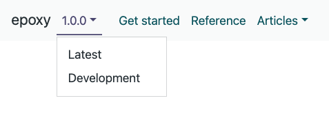
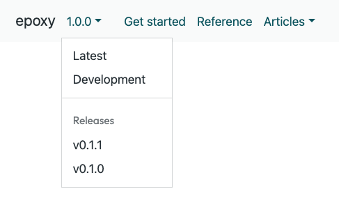
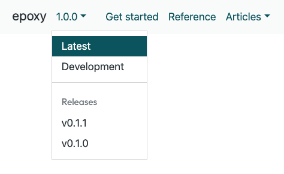
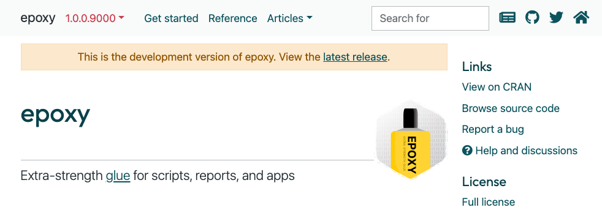

```{r, include = FALSE}
knitr::opts_chunk$set(
  collapse = TRUE,
  comment = "#>"
)
```

The version dropdown extension
replaces the pkgdown version number
with a version dropdown menu
that allows users to switch between different versions of the package.

You can see the extension in action
on the [epoxy pkgdown site](https://pkg.garrickadenbuie.com/epoxy/).

## Setup

There are three components to this feature:

1. We assume there is a single source of truth for all dropdown menus,
   stored in a file `doc-versions.json` in the root of your pkgdown site.

   Typically, this file is found in the `gh-pages` branch of your repo.
   You can store the file in `pkgdown/assets/doc-versions.json`
   so that it's copied automatically into your pkgdown site,
   but only the file at the global root of the pkgdown site is used.
   This way, older versions of the site
   will still be able to link to the latest release list.

   We'll talk about the format of this file in a moment.

2. You need to set up the build process for your pkgdown site
   in a way that keeps separate copies of the website for each version of the
   package.

   One way to do this is to use the
   [rstudio/education-workflows pkgdown action](https://github.com/rstudio/education-workflows/tree/main/examples#deploy-pkgdown-to-github-pages-with-pr-previews-and-tagged-versions).

3. The final bit is a JavaScript file that needs to be included after the body
   in the pkgdown template. Every version of the rendered site needs to have
   this JavaScript, and it's added automatically by the pkgdown template.

## Versions file

### Basic versions menu

At its most simple,
the `doc-versions.json` file is a JSON file
containing an array of elements to show in the version dropdown.
Each element must contain the `text` and `url` properties.



For example,
to create a dropdown menu linking to
the current release and the development version,
you could use the following `doc-versions.json`.
This is the most typical use case for pkgdown sites
that use `development: {mode: auto}`.

```json
[
  {
    "text": "Latest",
    "url": "https://pkg.garrickadenbuie.com/epoxy/"
  },
  {
    "text": "Dev",
    "url": "https://pkg.garrickadenbuie.com/epoxy/dev/"
  }
]
```

### Dividers and headings



If your pkgdown workflow builds a new site for each release,
you might want to create a dropdown menu that links to previous releases.
In this case,
you might also want to add a divider in the dropdown menu,
and possibly even a header in the new section.
Dropdowns are created using a literal `"---"` string,
and headers are created with any other string.

```json
[
  {
    "text": "Latest",
    "url": "https://pkg.garrickadenbuie.com/epoxy/"
  },
  {
    "text": "Dev",
    "url": "https://pkg.garrickadenbuie.com/epoxy/dev/"
  },
  "---",
  "Releases",
  {
    "text": "v0.1.1",
    "url": "https://pkg.garrickadenbuie.com/epoxy/v0.1.1/"
  },
  {
    "text": "v0.1.0",
    "url": "https://pkg.garrickadenbuie.com/epoxy/v0.1.0/"
  }
]
```

### Providing a version number



In the above example,
the version dropdown can infer the version number
for the two previous releases from the `text` property.
When the version dropdown knows an entry's version,
it can also tell if the current page is part of that version's site,
and it will mark the dropwn item as active.

When the `text` property isn't a version number,
you can explicitly provide the version number in the `version` property
(without the leading `v`).

```json
[
  {
    "text": "Latest",
    "version": "1.0.0",
    "url": "https://pkg.garrickadenbuie.com/epoxy/"
  },
  {
    "text": "Dev",
    "version": "1.0.0.9000",
    "url": "https://pkg.garrickadenbuie.com/epoxy/dev/"
  },
  "---",
  "Releases",
  {
    "text": "v0.1.1",
    "url": "https://pkg.garrickadenbuie.com/epoxy/v0.1.1/"
  },
  {
    "text": "v0.1.0",
    "url": "https://pkg.garrickadenbuie.com/epoxy/v0.1.0/"
  }
]
```

### Banners



Finally, you may wish to include a banner at the top of the website for older versions or the dev version.

You can achieve this by adding a `banner` property
to the version dropdown item objects.
The `banner` property should be an object
with `html` and `class` properties.

* The `html` property contains the message shown in the banner, in HTML.
  To link to the current page in the latest global pkgdown site,
  use a bare `<a>...</a>` tag, without providing an `href` attribute.

* The `class` property is optional and is added to the classes on the banner,
  which will already includes the `.alert` class.
  Use classes like `alert-info`, `alert-danger` or `alert-warning`.

To add a banner to a site's version,
the version dropdown extension must be able to match
the entry in `doc-versions.json` to the version of the current site.
(Otherwise it won't know which banner is appropriate to show.)

Here's a complete example of the `doc-versions.json` file
for the [epoxy pkgdown site](https://pkg.garrickadenbuie.com/epoxy/).

```json
[
  {
    "text": "Latest",
    "version": "1.0.0",
    "url": "https://pkg.garrickadenbuie.com/epoxy/"
  },
  {
    "text": "Development",
    "version": "1.0.0.9000",
    "url": "https://pkg.garrickadenbuie.com/epoxy/dev/",
    "banner": {
      "html": "This is the development version of epoxy. View the <a>latest release</a>.",
      "class": "alert-warning"
    }
  },
  "---",
  "Releases",
  {
    "text": "v0.1.1",
    "url": "https://pkg.garrickadenbuie.com/epoxy/v0.1.1/",
    "banner": {
      "html": "A <a>newer version of epoxy</a> is available!",
      "class": "alert-info"
    }
  },
  {
    "text": "v0.1.0",
    "url": "https://pkg.garrickadenbuie.com/epoxy/v0.1.0/",
    "banner": {
      "html": "A <a>newer version of epoxy</a> is available!",
      "class": "alert-info"
    }
  }
]
```

